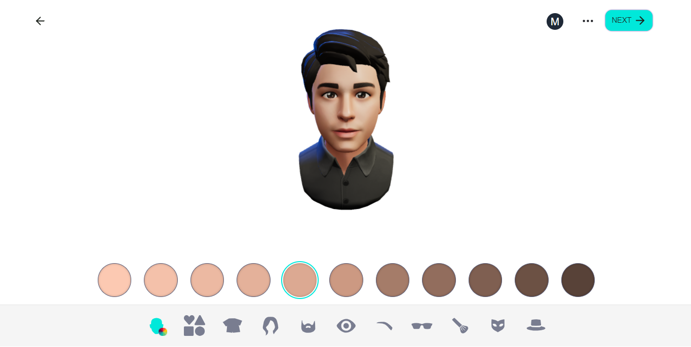

# Ngx Profile Avatar

Interactive 3D Avatar Profile Viewer generated in Ready Player Me

## Demostraciones

### Cursor Tracker

> La rotacion del modelo, cabeza, ojos y cuello reaccionara al movimiento del cursor.


### Face Tracker

> La rotacion del modelo, cabeza, cuello y las animaciones faciales reaccionaran a sus expresiones y movimientos detectados por la camara.


## Genera tu Avatar 3D

1. Dirigete a la siguiente aplicacion web: [vr.readyplayer.me/avatar](https://vr.readyplayer.me/avatar).
1. Configura tu avatar tridimensional.
1. Al finalizar, copia el enlace generado al archivo con extension `.glb` o descarga el archivo y agregalo a la carpeta `assets` de tu proyecto en `Angular`.



## Instala Ngx Profile Avatar

1. Instala esta librería en tu proyecto con el comando: `npm install @michaelldev/ngx-profile-avatar`.
1. Importa el modulo NgxProfileAvatarModule.

```typescript
import { BrowserModule } from '@angular/platform-browser';
import { NgModule } from '@angular/core';
import { AppComponent } from './app.component';

import { NgxProfileAvatarModule } from '@michaelldev/ngx-profile-avatar';

@NgModule({
  declarations: [AppComponent],
  imports: [
    BrowserModule,
    AppRoutingModule,
    //...
    NgxProfileAvatarModule,
  ],
  providers: [],
  bootstrap: [AppComponent]
})
export class AppModule { }
```

1. Usa el componente `ngx-profile-avatar` como el ejemplo a continuacion:

```html
<ngx-profile-avatar url="assets/avatar.glb" tracker="cursor" (onLoading)="onLoadingAvatar($event)">
</ngx-profile-avatar>
```

1. Documentacion del componente

| Atributo | Descripcion | Type | Default |
|:---------|:------------|:-----|:--------|
| `[url]` |Ubicación publica o local del archivo `.glb` que contiene el modelo 3d de su avatar.| `string` | `null` |
| `[tracker]` |Metodo de reaccion de su modelo.| `'cursor', 'face'` | `'cursor'` |
| `(onLoading)` |Callback para saber el progreso de carga del archivo `.glb` | `EventEmitter<ProgressEvent>` | `-` |

> **Importante**
> De preferencia, define tracker como `cursor` . La opcion `face` todavia es experimental.
